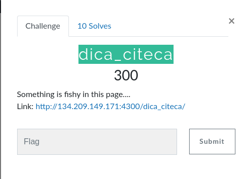
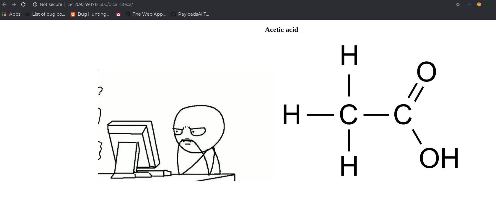
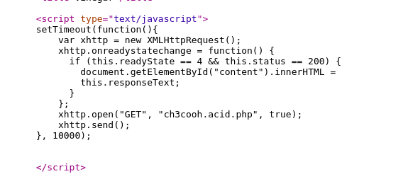
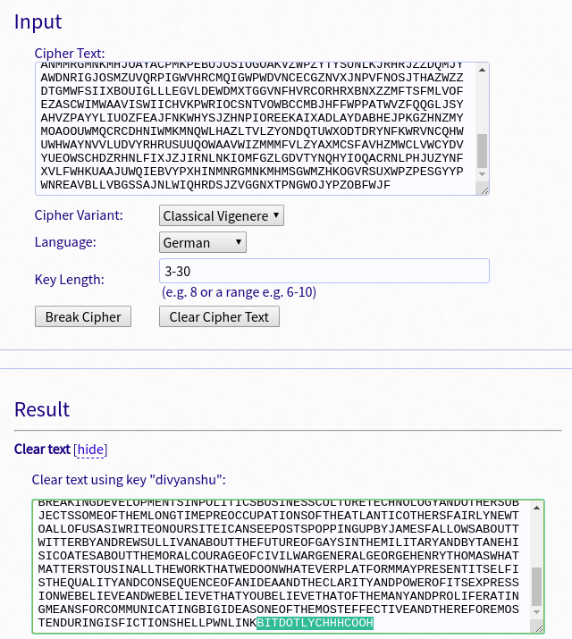

####  Challenge : Crypto

* Difficulty : Easy
* Level : Beginner

**Dica_CITECA**

#### Solved?

Yes

#### Tried:

* The challenge had a page depicting ch3cooh which meant acetic acid=vinegar

* Next upon inspecting the source code, we stumpled that there was a ajax request which is fetching the current response of the page from `ch3cooh.acid.php` file.

*  So we went to the link and got a weird paragraph now from the clues it was clear that it was Vigenere cipher but we had no key so we would bruteforce on it we used:

> https://www.guballa.de/vigenere-solver

*  Now after breaking we got this link at end bit.ly/chhhcooh which opened  a page which asked us key clearly the key was
`divyanshu` which was used to encrypt it, entering the key gave us the flag :

` shellctf{ch3mistry_is_myst3ry}`