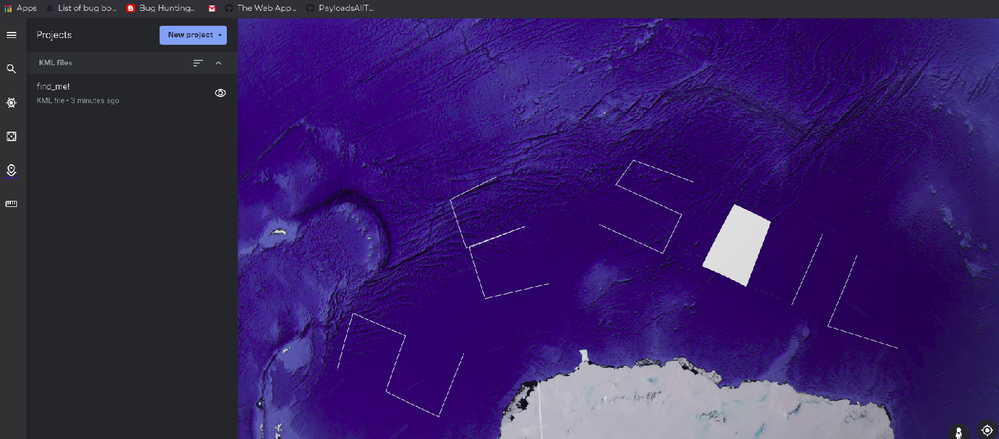

####  Challenge : Forensics

* Difficulty : Medium
* Level : Beginner

**Find Me!**

#### Solved?

Yes

#### Tried:

* In this challenge we had given a html file which was filled with cordinates comprising of latitued longitude altitude and height

* so it made us think that it was some kind of mapping which would display us
flag on more analysis of file we got to know its a google earth kml file which on plotting would tell us flag
So we got 
> https://earth.google.com/ 
* then create a new project and make settings import enable
then we rename our file to .kml and import it,

after which it displayed some characters and the image became like

* and gave us our flag
`shellCTF{2E5O1L}`

