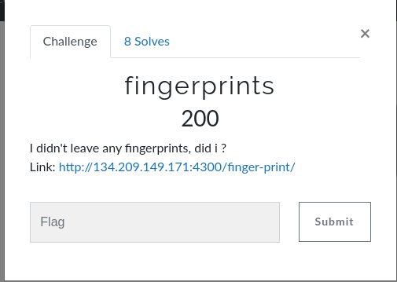
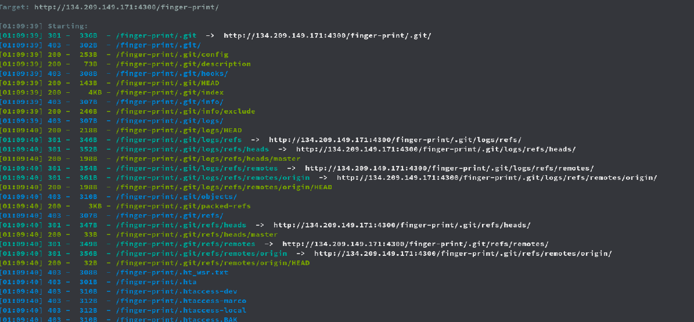
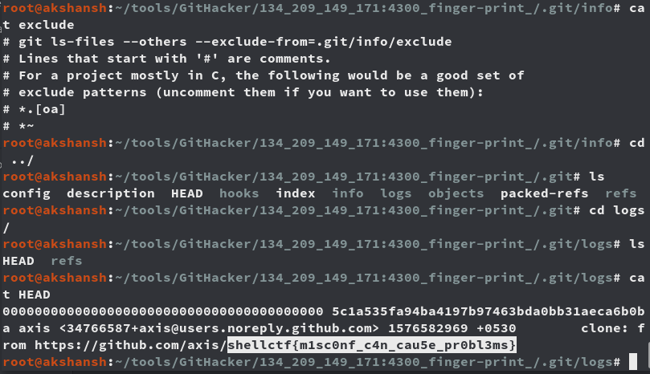

####  Challenge : Scripting
* Difficulty : Easy
* Level : Beginner
* Category : Web



```

#### Solved?

Yes

#### Tried:

* As the challenge header says "Fingerprint" , we just run a dirsearch with the common paths and found `.git` directory was accessible.



* Then we did git dumping where we fetched all common files and many refs possible aswell objects.



* In the `.git/logs/HEAD` file we got our flag.