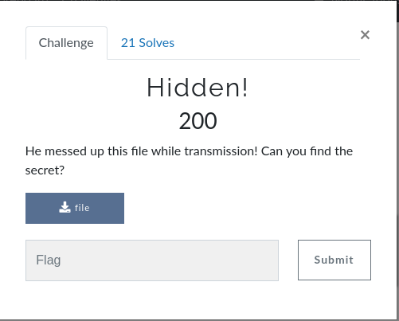
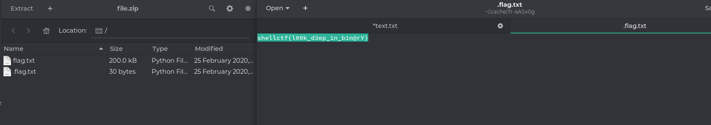

####  Challenge : Forensics

* Difficulty : Easy
* Level : Beginner

**Hidden!**

#### Solved?

Yes

#### Tried:

* In this challenge we had  a zip file at first extract it would give you a simple file which was filled with binary on a closer inspection of file

* we got another .flag.txt which gave us the flag

`shellctf{l00k_d3ep_1n_b1n@rY}`
