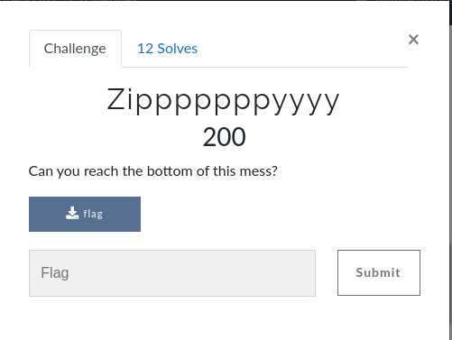

####  Challenge : Scripting
* Difficulty : Easy
* Level : Beginner

> There was a zip file provided which is archieved using different compressed containers and archievers in a sequence.




#### Solved?

Yes

#### Tried:

*  The challenge was given with a bz2 file now after first and second extract we realised that the files are 164kb zipped files with .zip and .bz2 zip types what we need to do is recursively unzip them and get the final text which gave us the flag.

* Total number of archievers used in recurse pattern are:

- Bz2
- Zip
- 7zip

```
 shellctf{$cr1ptiNg_I$_fUn}
 ```
